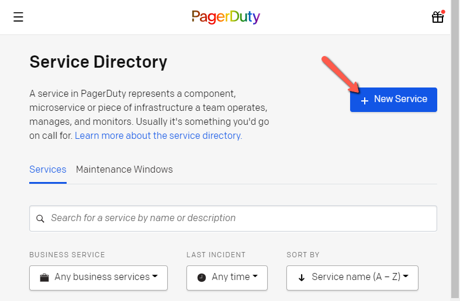
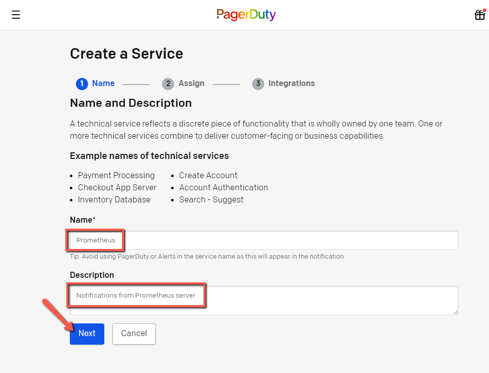
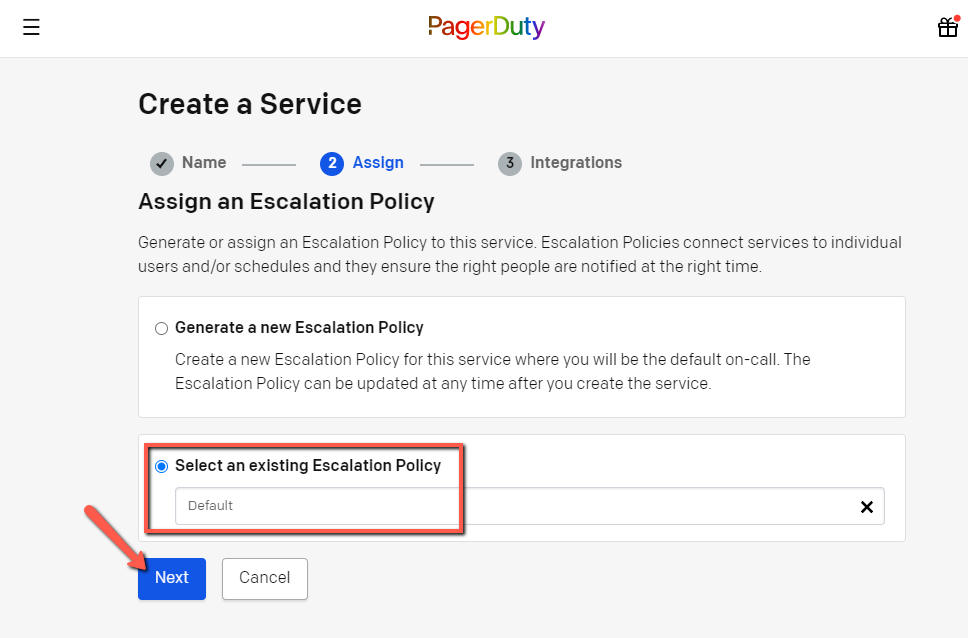
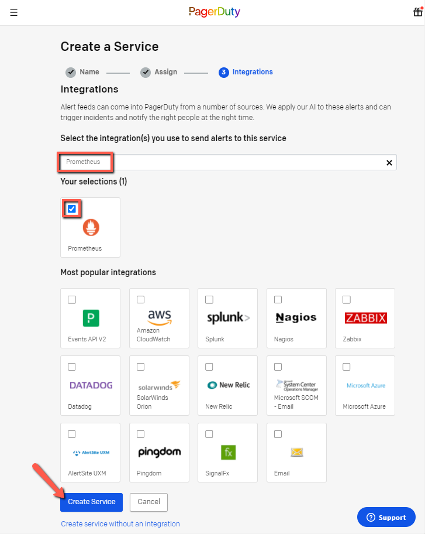
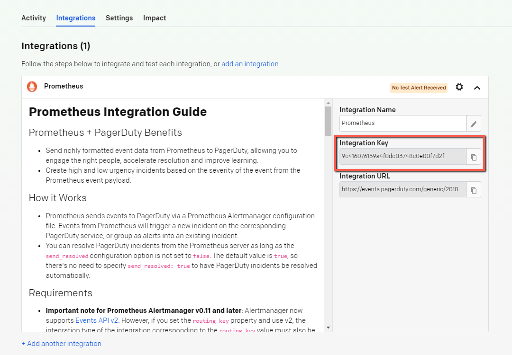
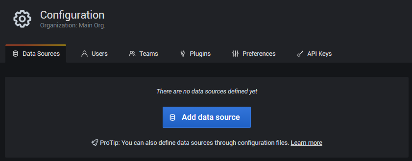
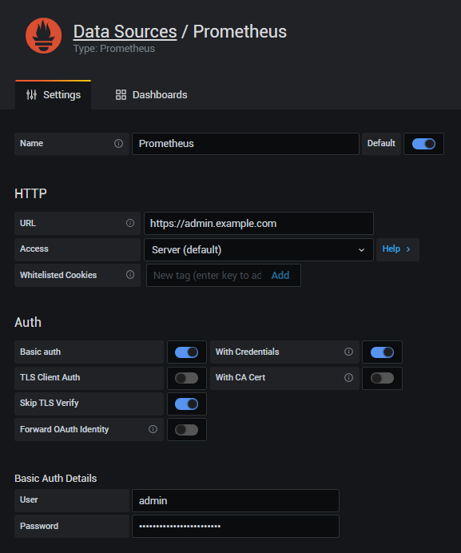
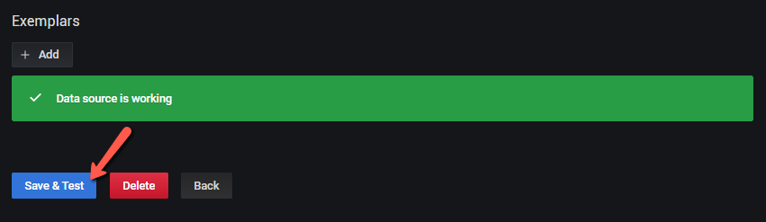

# README.md (Incomplete)

## Introduction
This is a tool to monitor the node perfomance. This will help to see the resources and performance data in the grafana dashboard also trigger the alert to the pagerduty using the alertmanager. We are using docker containers to run the services.

## Project Structure

```
Project
└───alertmanager
│   |   alertmanager.yml   
|
└───certbot
|   |   ...
│
└───grafana
|   └───config
|   |   └───dashboards
|   |       |   config.json
|   |
|   └───provisioning
|       └───dashboards
|           |   local.yml
|
└───nginx
|   |   ...
|
└───prometheus
│   │   first_rules.yml
│   │   prometheus.yml
│   
└───scripts
|   │   install_docker_git_etc.sh
|   │   install_ssl.sh
|
└───src
|   |   ...
|
|   docker-compose.yml
|   README.md
```

## Instruction to Setup Project
* Change to `usr` directory
    ```bash
    cd /usr
    ```
* Clone the prometheus-grafana repository    
    ```bash
    sudo git clone https://github.com/stake-ky/prometheus-grafana.git
    ```
* Change ownership of `prometheus-grafana` directory
    ```bash
    sudo chown -R $USER:$USER /usr/prometheus-grafana
    ```
* Install Docker and Docker-compose using the script provided. Update the Distribution Version/Name and Docker and Docker-compose Versions as applicable. 
    ```bash
    cd /usr/prometheus-grafana
    ```
    ```bash
    ./scripts/install_docker_git_etc.sh
    ```
* Create credentials to restrict public access to Prometheus.
    ```bash
    cd prometheus && sudo htpasswd -c .credentials admin
    ```
* Create random, complex root password variable for Grafana.
    ```bash
    cd /usr/prometheus-grafana && RANDOM_ROOT_PASSWORD=$(head /dev/urandom | tr -dc A-Za-z0-9 | head -c 24 ; echo '') &&\
    sed -i 's+RANDOM_ROOT_PASSWORD+'${RANDOM_ROOT_PASSWORD}'+g' docker-compose.yml
    ```
* Update project URL. Change `project_url` below, before running script.
    ```bash
    PROJECT_URL=project_url && find . -type f -exec sed -i 's+example.com+'${PROJECT_URL}'+g' {} \;
    ```    

## Integrate PagerDuty (Optional)

* Create a new service in `PagerDuty` by navigating to `Services -> Service Directory` and clicking on `New Service`.

    

* Provide a service `Name` and `Description` and click `Next`.

    

* Create a new `Escalation Policy` or select an exisiting policy, then click `Next`. In this example the `Default` policy was selected.

    

* Search for `Prometheus` using the filed provided and select as the `Integration`. Then click `Create Service` to continue.

    

* Save the `Integrations Key` in a safe place. It is required in the next step.

    

* Update the PagerDuty Integration Key in the `alertmanager.yml` configuration file under alertmanager directory. Replace the `PAGERDUTY_INTEGRATION_KEY` with the `Integration Key` obtained from the previous step or navigate to Services -> Service Directory -> Prometheus Automation -> Integrations from PagerDuty

    ```bash
    PAGERDUTY_INTEGRATION_KEY=integration_key && find alertmanager/alertmanager.yml -type f -exec sed -i 's+PAGERDUTY_INTEGRATION_KEY+'${PAGERDUTY_INTEGRATION_KEY}'+g' {} \;
    ```    
* Test your PagerDuty configuration by running the following test

    ```bash
    curl -d '[{"labels": {"Alertname": "PagerDuty Test"}}]' http://localhost:9093/api/v1/alerts
    ```

## Add Targets to Prometheus

* Update the following in `prometheus/prometheus.yml` for each target you want Prometheus to scrape:
    ```bash
      - job_name: '$VALIDATOR' # Update to reflect the name of the validator want to scrape
    # metrics_path: /metrics # Defaults to '/metrics'
    # scrape_interval: 5s
    scheme: https # Defaults to 'http'
    basic_auth:
      username: admin
      password: $MYCOMPLEXPASSWORD
    static_configs:
    - targets: ['node.example.com', 'miner.example.com']
    ```
    - Update `$VALIDATOR` and `targets` as well as `username` and `password` for each source.

## Installing SSL
* Open ports 80 and 443 on your server
* Install Let's Encrypt SSL using script 
    ```bash
    cd /usr/prometheus-grafana
    ```
    ```bash
    ./scripts/install_ssl.sh
    ```
    - If you receive a permission error, then you should log out/in of session, so that Docker permission can propogate to user. Confirm Docker is added with the following command:
    ```bash
    groups
    ```
* Stop running Nginx container
    ```bash
    docker-compose stop nginx
    ```
* Switch to Nginx SSL config
    ```bash
    rm nginx/default.conf && cp nginx/default_https.conf.template nginx/default.conf
    ```
* Recreate Nginx
    ```bash
    docker-compose up --build --force-recreate --no-deps -d nginx
    ```

## Launch Project
* Launch Docker-compose containers 
    ```bash
    docker-compose up -d --build
    ```
* Confirm all the containers are running using below command
    ```bash
    docker-compose ps
    ```

## Add Prometheus as Data Source in Grafana

* Navigate to `/datasources` in [Grafana Admin](https://admin.example.com/datasources) and click on `Add data source'
    
    

* Add the configuration details for your Prometheus instance

    

* Save & Test the configuration

    

# Inspiration

* [How to Setup Grafana and Prometheus on Linux](https://devconnected.com/how-to-setup-grafana-and-prometheus-on-linux/)

* [Prometheus Node Exporter](https://github.com/prometheus/node_exporter)
    - [Helium Miner Grafana Dashboard](https://github.com/tedder/helium_miner_grafana_dashboard)
    - [Cosmos Grafana Dashboard](https://grafana.com/grafana/dashboards/11036)

* [Helium Miner Exporter](https://github.com/tedder/miner_exporter)

* [PagerDuty/Prometheus Integration Guide](https://www.pagerduty.com/docs/guides/prometheus-integration-guide)